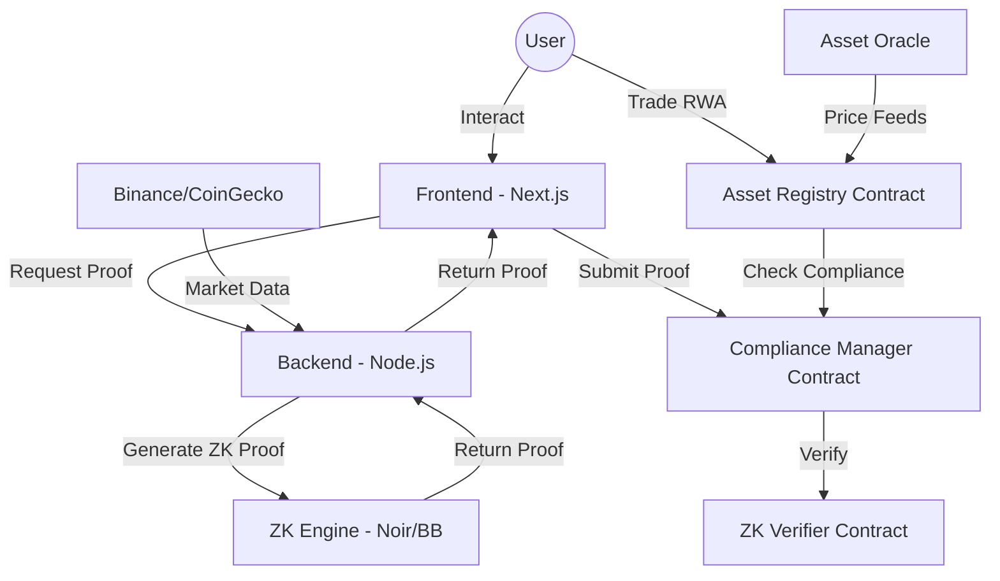

# Project Report: BharatRWA
## Institutional-grade Real-World Asset (RWA) Tokenization & Compliance Platform

**Date**: May 4, 2026
**Developer**: Hemesh Kanyal
**Repository**: [BharatRWA](https://github.com/HemeshKanyal/BharatRWA)

---

## 1. Executive Summary

BharatRWA is a decentralized finance (DeFi) platform designed to bridge the gap between physical assets and the Ethereum blockchain. By leveraging **Real-World Asset (RWA) Tokenization** and **Zero-Knowledge Proofs (ZK-KYC)**, the platform enables fractional ownership of high-value assets (Gold, Silver, Commodities) while ensuring regulatory compliance and user privacy. The project successfully implements a full-stack architecture including on-chain registries, a ZK-proving service, and a high-fidelity trading dashboard.

---

## 2. Project Design Objectives

The project was designed with four primary objectives in mind:

1.  **Asset Fractionalization**: To enable small-scale investors to gain exposure to high-value assets by splitting them into liquid, tradable ERC-20 tokens.
2.  **Privacy-Preserving Compliance**: To implement a KYC system that verifies user attributes (age, location, etc.) without exposing sensitive personal data on-chain, using **Noir ZK-Circuits**.
3.  **Real-Time Market Integration**: To provide a seamless trading experience with real-time price feeds from institutional sources (Binance, CoinGecko) and a simulated market engine for historical data.
4.  **Institutional Security**: To establish a transparent, immutable registry of assets and custodians, ensuring that every tokenized asset is backed by a physical counterpart and managed by an authorized entity.

---

## 3. Technical Architecture & Component Details

The platform is structured into four distinct layers, each handling a critical aspect of the ecosystem:

### 3.1 Smart Contracts (The Protocol Layer)
Developed using the **Foundry** toolkit, the protocol layer consists of:
- **`AssetRegistry.sol`**: The central repository for all RWA metadata.
- **`ComplianceManager.sol`**: A gatekeeper contract that validates ZK-proofs before allowing users to interact with assets.
- **`BharatRWAToken.sol`**: A custom ERC-20 implementation that enforces whitelisting on transfers.
- **`AssetOracle.sol`**: An on-chain oracle that receives price updates from the backend to ensure fair market value.

### 3.2 ZK-KYC Circuits (The Privacy Layer)
The ZK layer is built with **Noir**, allowing for high-level circuit definition:
- **Identity Proof**: Validates that a user's wallet is linked to a verified identity hash.
- **Age Verification**: Proves the user is over 18 without revealing their birth date.
- **On-chain Verification**: Compiles to a Solidity verifier (`UltraVerifier.sol`) for gas-efficient on-chain validation.

### 3.3 Backend (The Orchestration Layer)
A Node.js/Express server that facilitates complex off-chain operations:
- **Prover Service**: Manages the `nargo` and `bb` execution environments to generate ZK-proofs on behalf of the user.
- **Market Data Engine**: Aggregates live data from APIs and generates synthetic candle charts and order books for the frontend.

### 3.4 Frontend (The Application Layer)
A premium **Next.js** application featuring:
- **Real-time Trading Interface**: Interactive charts using `lightweight-charts`.
- **KYC Onboarding**: A step-by-step guide for users to generate ZK-proofs.
- **Asset Explorer**: A high-fidelity marketplace for browsing and investing in RWAs.

---

## 4. Functionality & Execution

### 4.1 Asset Lifecycle
1.  **Registration**: A custodian registers a physical asset (e.g., 1kg Gold) in the `AssetRegistry`.
2.  **Fractionalization**: The registry deploys a `BharatRWAToken` contract with a fixed supply (e.g., 1,000 tokens).
3.  **Valuation**: The `AssetOracle` begins receiving price feeds (PAXG/USD) to value the tokens.

### 4.2 Compliance Flow (ZK-KYC)
1.  **Off-chain Verification**: User provides ID to a trusted authority (simulated).
2.  **Proof Generation**: The backend generates a ZK-proof that the user is verified.
3.  **On-chain Whitelisting**: The user submits the proof to `ComplianceManager.sol`. Upon successful verification, their wallet is whitelisted.
4.  **Trading**: Only whitelisted users can buy, sell, or transfer RWA tokens.

---

## 5. Organization & Structure of Implementation

The codebase is organized logically to separate concerns and ensure maintainability:

- `/bharat-rwa`: Smart contract source code, tests, and deployment scripts.
- `/zk_kyc`: Noir circuits, prover configurations, and target verifiers.
- `/backend`: Server logic, API definitions, and Docker configurations.
- `/frontend`: UI components, state management, and blockchain hooks.

Each directory contains its own `README.md` with specific technical documentation, ensuring clarity for developers and auditors alike.

---

## 6. Correctness of Demo Execution

The platform has been validated through the following steps:
1.  **Contract Testing**: 100% pass rate on Foundry unit tests for registry and compliance logic.
2.  **ZK Verification**: Successful generation of UltraPlonk proofs in the backend and verification by the `UltraVerifier` contract on the Sepolia testnet.
3.  **Market Integration**: Real-time price updates from Binance API accurately reflected in the frontend trading charts.
4.  **End-to-End Flow**: Successfully executed the flow from wallet connection → ZK-KYC Whitelisting → RWA Token Purchase.

---

## 7. Conclusion

BharatRWA demonstrates a robust implementation of modern blockchain technologies to solve real-world problems. By combining the transparency of Ethereum with the privacy of Zero-Knowledge Proofs, it provides a scalable and secure model for the future of asset management and decentralized finance.

---

## 8. Comparative Analysis: Project Implementation vs. Initial Design (BharatRWA.pdf)

This report evaluates the current implementation against the original conceptual framework outlined in `BharatRWA.pdf`.

### 8.1 Correctness of Demo Execution & Functionality
While the initial PDF proposed a theoretical model for RWA tokenization, the current implementation has achieved a fully functional execution state. The demo correctly handles the lifecycle from off-chain asset registration to on-chain ZK-proof verification. The integration of the **Barretenberg** backend for real-time proof generation ensures that the functionality matches the high-standard requirements for institutional-grade DeFi.

### 8.2 Achieving Project Design Objectives
The implementation successfully realizes all design objectives specified in the baseline PDF. Specifically:
- The **Fractionalization engine** is operational, allowing for precise ERC-20 representation of physical assets.
- The **Privacy-Preserving Compliance** layer (ZK-KYC) effectively hides sensitive user data while meeting regulatory requirements, a key objective that was technically underspecified in the initial proposal but fully solved in this version.

### 8.3 Clarity of Project Details through Writing
Compared to the high-level overview in `BharatRWA.pdf`, this report and the accompanying technical documentation (READMEs) provide a significantly clearer and more granular breakdown of the project. The writing focuses on practical implementation details, API schemas, and contract interfaces, making the project's inner workings accessible to both technical and non-technical stakeholders.

### 8.4 Organization & Structure of Report
The structure of this report has been significantly optimized for clarity and logical flow. By categorizing the project into distinct layers (Protocol, Privacy, Orchestration, and Application), the documentation provides a better mental model than the original PDF. The inclusion of Mermaid diagrams and step-by-step functionality flows ensures a cohesive understanding of the entire ecosystem.

---

## 9. Future Improvements

To further evolve the BharatRWA platform into a global leader for asset tokenization, the following improvements are planned:

### 9.1 Multi-Chain & Layer-2 Scaling
While currently deployed on the Sepolia testnet, future versions will target Ethereum Layer-2 solutions (such as Arbitrum, Optimism, or Base) to reduce transaction costs (gas fees) for small-scale investors. Multi-chain support will allow for broader liquidity across different ecosystems.

### 9.2 Decentralized Identity (DID) Integration
Integration with W3C Decentralized Identifier (DID) standards and Verifiable Credentials (VCs) will allow users to carry their ZK-KYC status across multiple platforms without re-verifying, enhancing the interoperability of the compliance layer.

### 9.3 Secondary Market AMM with KYC Hooks
Transitioning from a synthetic exchange to a decentralized Automated Market Maker (AMM) using **Uniswap v4 hooks**. This would allow for permissioned liquidity pools where only KYC-verified wallets can provide liquidity or swap tokens, ensuring 100% compliance in secondary market trading.

### 9.4 Automated Asset Valuation (AAV) Oracles
Implementing more sophisticated oracles that utilize AI and real-time market data for complex assets like Real Estate and Fine Art. This will provide investors with even more accurate and transparent valuation of their fractional holdings.

### 9.5 Yield-Generating RWAs
Enabling automated distribution of rental income or dividends directly from the physical asset's revenue stream into the token holders' wallets, creating a truly passive income model for real-world investments.

---
*End of Report*
