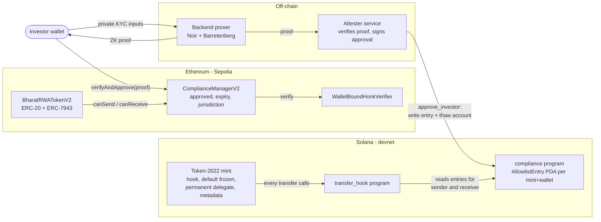

# BharatRWA

BharatRWA is a testnet prototype for issuing real-world-asset (RWA) tokens
that only verified investors can hold and transfer. Investors prove they meet
KYC rules (age, KYC status, not sanctioned) with a Noir zero-knowledge proof,
so no identity documents go on-chain.

The same compliance model runs on two chains:

- **Ethereum (Sepolia):** an ERC-20 token that implements
  [ERC-7943 (uRWA)](https://eips.ethereum.org/EIPS/eip-7943), backed by an
  on-chain compliance registry that verifies the ZK proof itself.
- **Solana (devnet):** an SPL Token-2022 mint whose transfer hook checks an
  on-chain allowlist. The ZK proof is verified off-chain, and an attester
  writes the result on-chain.

Status: testnet/devnet only, not audited. See [Known limitations](#known-limitations).

## Repository layout

| Path | Contents |
|---|---|
| [`bharat-rwa/`](bharat-rwa/) | Solidity contracts (Foundry): compliance managers, ERC-20 / ERC-7943 tokens, asset registry, oracle, dividends, ZK verifiers |
| [`solana/`](solana/) | Anchor workspace: `compliance` and `transfer_hook` programs, TypeScript scripts and tests |
| [`zk_kyc/`](zk_kyc/) | Noir circuit (pedersen wallet-hash variant) |
| [`backend/`](backend/) | Node/Express API: proof generation, market data, Sepolia transactions. Its circuit is in `backend/zk_kyc/`. |
| [`frontend/`](frontend/) | Next.js app: marketplace, trading view, KYC flow |

## Architecture



### Ethereum

1. The investor submits their proof to `ComplianceManagerV2.verifyAndApprove`.
   The contract checks that the proof was generated for `msg.sender`, that the
   age/KYC/sanction flags pass, and that the nullifier is unused. It then
   calls the on-chain UltraHonk verifier and records an approval with an
   expiry.
2. `BharatRWATokenV2` asks the compliance manager on every transfer, mint and
   burn whether each party is approved and not blacklisted (`canSend` /
   `canReceive`). It also enforces per-account frozen amounts and pause.
3. Holders with `FREEZER_ROLE` and `ENFORCEMENT_ROLE` can freeze amounts and
   force transfers (court order, recovery).

The original `ComplianceManager` and `BharatRWAToken` are still deployed and
unchanged. Both tokens accept either compliance manager through the shared
`IComplianceManager` interface. Details: [`bharat-rwa/README.md`](bharat-rwa/README.md).

### Solana

1. The backend proves and verifies the investor's ZK proof **off-chain**.
2. The attester key calls `approve_investor`. This writes an allowlist entry
   (approved flag, jurisdiction, expiry) and thaws the investor's token
   account, which starts frozen because of the mint's default account state.
3. On every transfer, Token-2022 calls the transfer hook. The hook rejects the
   transfer unless both the sender's and the receiver's entries are valid. It
   finds those accounts through the extra-account-metas PDA, the same way any
   wallet resolves them.
4. The issuer can freeze accounts (placing a legal hold the attester can't
   lift) and force transfers as the mint's permanent delegate.

On Solana, you trust the attester to have checked the proof. On Ethereum, the
contract checks the proof itself. Details and trade-offs:
[`solana/README.md`](solana/README.md).

## ERC-7943 on Token-2022

How each part of ERC-7943's fungible interface maps onto Token-2022 in this
repo, and where the mapping is incomplete.

| ERC-7943 (EVM: `BharatRWATokenV2`) | Token-2022 equivalent (Solana) | Limitations |
|---|---|---|
| `canSend(account)` / `canReceive(account)` | Transfer hook reads the sender's and receiver's `AllowlistEntry` (approved and not expired) | Not callable as a view. Clients read the entry PDA `["allowlist", mint, wallet]` instead. There is no blacklist separate from `approved = false`. |
| `canTransfer(from, to, amount)` | Transfer hook `execute`, plus Token-2022's own frozen-account check | No simulation-free view; use transaction simulation. The hook ignores `amount`; no amount-based rules. |
| `setFrozenTokens` / `getFrozenTokens` | Mint freeze authority (compliance `Config` PDA) and `DefaultAccountState = Frozen`; issuer `freeze_account` / `thaw_account` | **Whole-account only.** Token-2022 freezes an entire token account, so you can't freeze part of a balance or freeze more than is held. `getFrozenTokens` becomes "is the account frozen". |
| `forcedTransfer(from, to, amount)` | Permanent delegate (issuer) signs `transfer_checked`; the hook skips the sender check for the delegate | Frozen accounts can't send even for the delegate, so the client sends thaw → transfer → re-freeze atomically. The receiver must still be allowlisted (same as ERC-7943's `canReceive(to)` advice). |
| `Frozen` / `ForcedTransfer` events | Anchor events `AccountFrozen`, `AccountThawed`, `InvestorApproved`…; the forced transfer shows up as a normal transfer signed by the delegate | No dedicated forced-transfer event; indexers recognise forced transfers by the authority being the permanent delegate. |
| Pause (a permissioned rule in `canTransfer`) | Not enabled | Token-2022 has a Pausable extension; this mint doesn't use it. |
| ERC-165 `supportsInterface(0x3edbb4c4)` | None | Solana has no interface detection. Clients inspect the mint's extensions. |
| Token metadata (ERC-20 `name`/`symbol`; not part of ERC-7943) | Metadata pointer to the mint itself, with on-mint `TokenMetadata` (name, symbol, URI) | — |
| ZK-KYC verified inside `verifyAndApprove` | Proof verified off-chain; the attester writes the entry | The chain enforces only the attester's decision. See the trade-off notes in `solana/README.md`. |

## Deployments

### Solana devnet

| | Address |
|---|---|
| Compliance program | `588hz1dHm9goLKBAt4yRwNaEDeuF97teDrjd2E6XdE9E` |
| Transfer hook program | `AtGeNjNoNobDCBP6gvtgDK1gvsWkQe2Xm3F5RziJkS88` |
| BMOT mint | `4PC4Qm73fAvQLQNjX6xg569nQBGJx1VkdY9aZ3E99Epy` |

Demo transactions are listed in [`solana/README.md`](solana/README.md#devnet-deployment).

### Sepolia

| Contract | Address |
|---|---|
| AssetRegistry (proxy) | `0x774E3195E3efB0fa403366033881C6ab1fe14B0D` |
| ComplianceManager V1 (proxy) | `0x07bfd4e030Cf250597A898E9EF43110365c7dbAC` |
| AssetOracle | `0x590AE2361F302B274a7FB7277E1f15A450BBF392` |
| DividendDistributor | `0x8E53f313a17C3f6347696Fd2C87B97cDdE52F52C` |

These are the original V1 deployments. The V1 ComplianceManager's verifier
accepts any proof (it was deployed with the mock verifier), so on Sepolia
today anyone can become "approved". `BharatRWATokenV2` and
`ComplianceManagerV2` are not deployed yet; see
[Deploy](#ethereum-sepolia).

## Setup, test and deploy

### Prerequisites

| Tool | Version used | Needed for |
|---|---|---|
| Node.js | 24 (backend Docker image: 18) | backend, frontend, Solana scripts |
| [Foundry](https://getfoundry.sh/) | 1.8.3 | Ethereum contracts |
| Rust | 1.99 (programs pin 1.89 via `rust-toolchain.toml`) | Solana programs |
| [Solana CLI (Agave)](https://docs.anza.xyz/cli/install) | 4.3.0 | Solana |
| [Anchor CLI](https://www.anchor-lang.com/docs/installation) | 1.2.1 | Solana |
| [Nargo](https://noir-lang.org/docs/getting_started/installation) / Barretenberg `bb` | 1.0.0-beta.22 / 5.0.0-nightly.20260522 | regenerating circuits and verifiers |

### Ethereum (Sepolia)

The Foundry dependencies aren't committed. Fetch the versions pinned in
`bharat-rwa/foundry.lock`:

```bash
cd bharat-rwa
mkdir -p lib && cd lib
git clone --depth 1 --branch v1.15.0 https://github.com/foundry-rs/forge-std
git clone --depth 1 --branch v5.6.1  https://github.com/OpenZeppelin/openzeppelin-contracts
git clone --depth 1 --branch v5.6.1  https://github.com/OpenZeppelin/openzeppelin-contracts-upgradeable
cd ..
```

Build and test:

```bash
forge build
forge test                 # 170 tests, including a real ZK proof verified on-chain
make test-fuzz             # fuzz tests with 1,000 runs
```

Deploy (put `PRIVATE_KEY`, `SEPOLIA_RPC_URL` and `ETHERSCAN_API_KEY` in `bharat-rwa/.env`):

```bash
make deploy-token-v2-dry-run     # simulate against Sepolia
make deploy-token-v2-sepolia     # WalletBoundHonkVerifier + ComplianceManagerV2 + BharatRWATokenV2

# alternatively, point the new token at the existing V1 ComplianceManager:
COMPLIANCE_MANAGER=0x07bfd4e030Cf250597A898E9EF43110365c7dbAC make deploy-token-v2-sepolia
```

The deploy script refuses to run on any chain other than Sepolia or a local
Anvil node. The original V1 stack is deployed with `make deploy-sepolia`
(`script/DeployAll.s.sol`).

To regenerate the wallet-bound verifier and the proof fixture after changing
`backend/zk_kyc`:

```bash
make zk-verifier-wallet-bound
```

### Solana (devnet)

```bash
cd solana
npm install
anchor build
npm test                   # 20 tests on a local solana-test-validator
```

Deploy and run the end-to-end flow on devnet:

```bash
solana config set --url devnet
solana address                      # fund with ~3 devnet SOL from https://faucet.solana.com
anchor keys sync && anchor build       # fresh clone only: use your own program IDs
anchor deploy --provider.cluster devnet
npm run mint:create                 # create the Token-2022 mint with all extensions
npm run demo                        # approve, mint, transfer, blocked transfer, freeze, forced transfer
```

Individual scripts (`investor:approve`, `mint:to`, `transfer`,
`transfer:blocked`, `account:freeze`, `transfer:forced`) are documented in
[`solana/README.md`](solana/README.md#scripts). Generated keypairs go to
`solana/keys/`, which is gitignored.

### Backend

```bash
cd backend
npm install
# backend/.env (gitignored): PRIVATE_KEY=..., SEPOLIA_RPC_URL=...
node --env-file=.env server.js      # listens on :3008
```

Both variables are required; the server exits if either is missing. The
Docker image (`backend/Dockerfile`) is what runs on Hugging Face Spaces, where
they are set as Space secrets.

### Frontend

```bash
cd frontend
npm install
npm run dev                         # http://localhost:3000
```

Contract addresses are in `frontend/src/config.js`. The backend URL defaults
to the hosted backend; set `NEXT_PUBLIC_BACKEND_URL=http://localhost:3008` to
use a local one. After deploying `BharatRWATokenV2`, set
`CONTRACTS.TOKEN_V2` and `CONTRACTS.COMPLIANCE_MANAGER_V2` in `config.js` to
switch the compliance checker and dashboard to the V2 contracts.

## Known limitations

- **Self-declared KYC inputs.** The circuit proves statements about values the
  user typed in (age, KYC flag, sanction flag). No KYC provider signs them, so
  the proof shows only that the user claimed them. Fixing this needs a
  provider signature verified inside the circuit.
- **V1 ZK flow is not sound.** The V1 `ComplianceManager` doesn't bind proofs
  to the caller, and the deployed Sepolia verifier accepts any input.
  `ComplianceManagerV2` fixes both for new deployments.
- **The frontend still submits proofs to the V1 ComplianceManager.** The
  backend now generates real, wallet-bound proofs with all six public inputs
  (and never fakes one), so it's ready for `ComplianceManagerV2`. The
  frontend switches over once V2 is deployed and configured.
- **Two circuits.** `zk_kyc/` (pedersen wallet hash) and `backend/zk_kyc/`
  (raw wallet) differ. Only the backend circuit has a matching, tested
  verifier (`WalletBoundHonkVerifier`).
- **The trading flow is a demo exchange.** Prices and order books are
  simulated. Settlement is checked on-chain: `/buy` mints only against a
  recent, unused ETH payment from the buyer, and `/sell` pays out only for a
  token transfer the seller made themselves.
- **Solana freezes whole accounts**, so ERC-7943 partial freezing has no
  direct equivalent. Jurisdiction is recorded on both chains but not enforced.
- **Single keys hold powerful roles** (issuer, attester, admin). Production
  use needs multisigs and key rotation.

## Tech stack

Solidity 0.8.28, Foundry, OpenZeppelin 5.6 · Rust, Anchor 1.2, SPL Token-2022 ·
Noir, Barretenberg (UltraHonk) · Node.js, Express, ethers v6 · Next.js 16,
React 19, Tailwind CSS 4, lightweight-charts.
